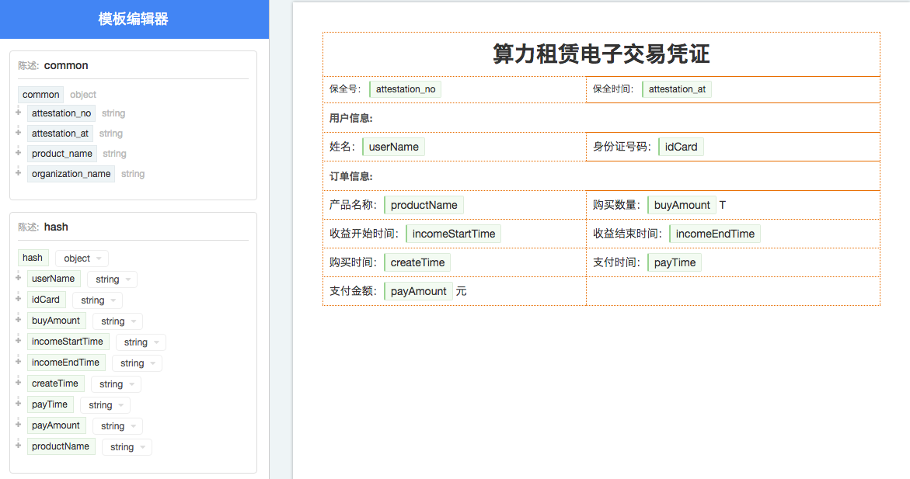
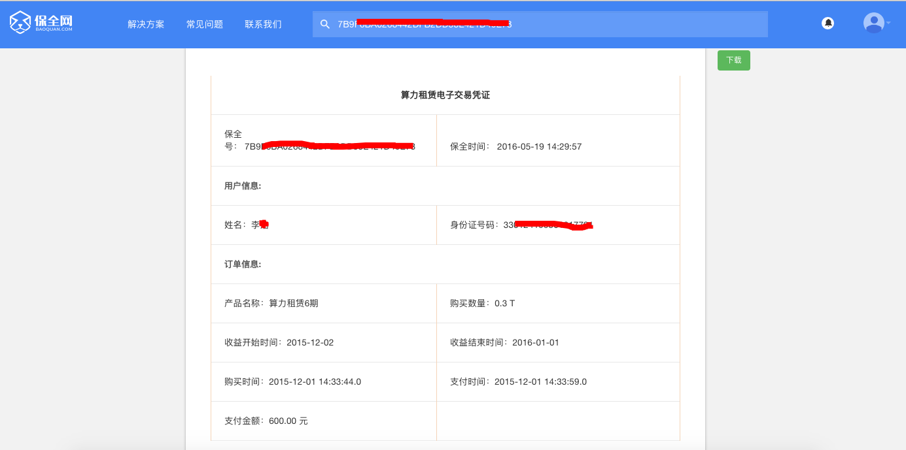
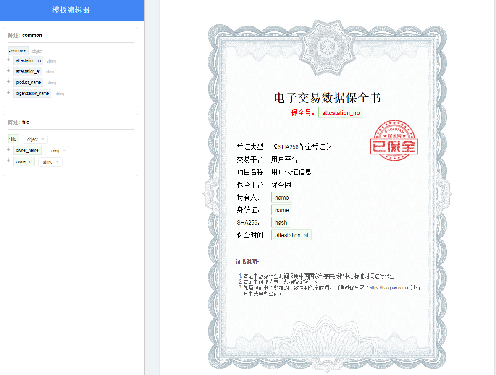
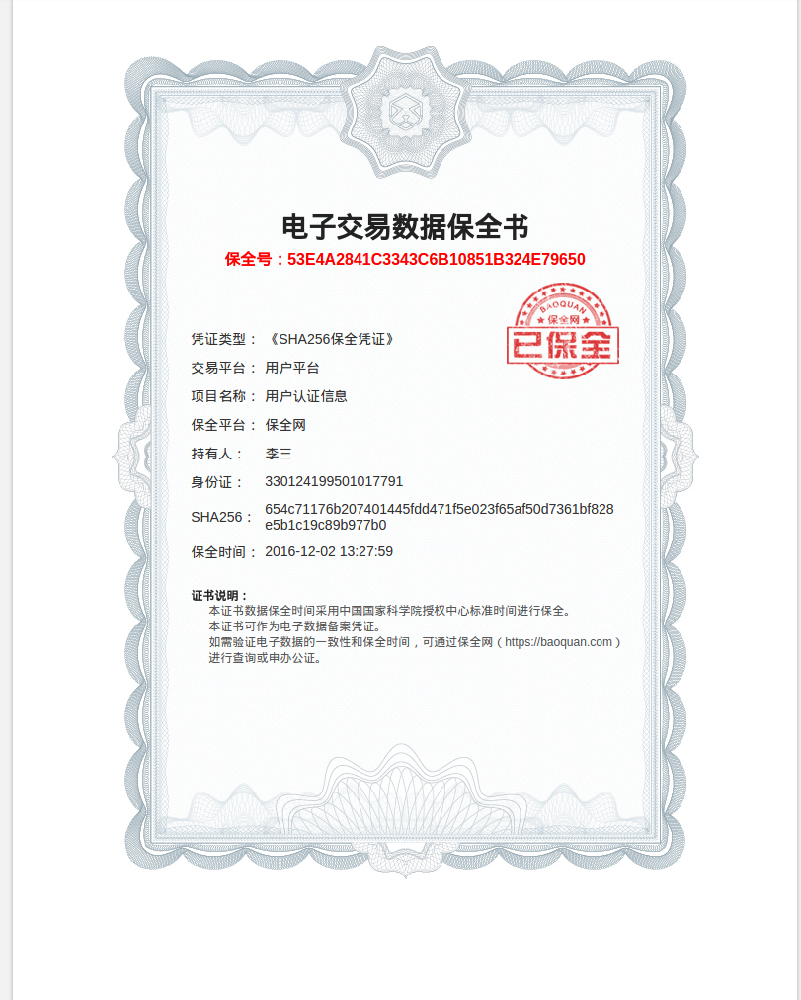
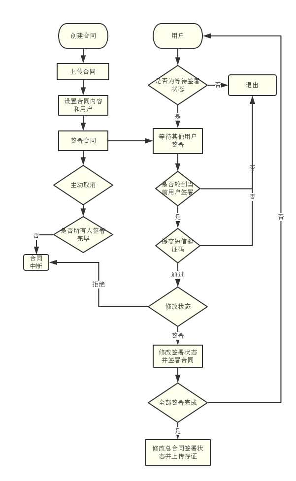

接口
===============

保全 - /attestations
----------------------

客户在保全网站上建好模板之后通过该接口传输模板渲染需要的数据。

payload
^^^^^^^^^^^^^^^

=================  ======================================= ================
参数名 				描述                                    是否可选
=================  ======================================= ================
unique_id          String字符串，不超过255位，保全唯一码          必选
template_id        String字符串，模板id                       必选
identities         Object对象，身份事项                        必选
factoids           数组对象，陈述集                           必选
completed          Boolean值，是否完成陈述集的上传            可选，默认为true
attachments        附件信息数组对象                           可选
=================  ======================================= ================

unique_id是保全唯一码，这个唯一码的作用是避免在网络超时或者其它异常的情况下接入方重复上传相同内容的保全数据。如果同样unique_id的保全内容多次上传，保全网只进行1次保全，并返回相同的保全号。

**陈述** 是一个Object对象，包含unique_id,type和data三个字段，例如::

	{
		"unique_id": "9de7be94-a697-4398-945a-678d3f916b9f",
		"type": "hash",
		"data": {
			"userName": "张三",
			"idCard": "42012319800127691X"
		}
	}

陈述的unique_id的作用跟保全的unique_id类似，如果某次保全过程中同样unique_id的陈述内容多次上传到保全网，保全网只处理1次。

type是客户定义的陈述名称，data是陈述的字段值，如下图所示：

模板中包含common和hash两个陈述。common中的attestation_no(保全号)、attestation_at(保全时间)、product_name(产品名称)、organization_name(组织名称)在模板渲染时由保全网提供。hash这个陈述是客户自己定义的，所以需要客户通过API上传。

.. note:: 
	在添加陈述对象是要保证陈述对象跟编辑模板时的要求一致。以下几种情况会导致保全失败：
	
	- 上传了模板中没有的陈述对象，比如模板中没有type为product的对象却上传了。
	- 模板中有字段是必要的，但是完成陈述上传时并没有上传该字段，比如user.name需要上传且不能为空，
	  但是没有上传type为user的data或者data中没有name这个字段。
	- 上传的字段的格式不符，比如模板中要求user.money是int型，但是上传的user.money值是"$100"

模板中可能包含多个客户自定义的陈述，比如factoA和factoB，此时客户可以选择分两次上传，第一次上传factoA，并设置completed为false，第二次上传factoB，并设置completed为true。

.. note:: 一旦completed设置为true，则不再接受陈述上传。

假定payload如下所示::

	{
		"unique_id": "acafa00d-5579-4fe5-93c1-de89ec82006e",
		"template_id": "2hSWTZ4oqVEJKAmK2RiyT4",
		"identities": {
			"MO": "15857112383",
			"ID": "42012319800127691X"
		},
		"factoids": [
			{
				"unique_id": "9de7be94-a697-4398-945a-678d3f916b9f",
				"type": "hash",
				"data": {
					"userName": "李三",
					"idCard": "330124199501017791",
					"buyAmount": 0.3,
					"incomeStartTime": "2015-12-02",
					"incomeEndTime": "2016-01-01",
					"createTime": "2015-12-01 14:33:44",
					"payTime": "2015-12-01 14:33:59",
					"payAmount": 600
				}
			}
		],
		"completed": true
	}

经过保全后，在保全网上可以通过保全号查看经过渲染后的内容，类似下图所示：

附件
^^^^^^^^^^^^^^^

在上传陈述数据的时候可以同时上传跟该陈述相关的附件，在payload中 **attachments** 存放的是附件的校验码。

form表单形式上传单个附件::

	<form method='post' enctype='multipart/form-data'>
	  ...
	  <input type=file name="attachments[0][]">
	</form>

	payload = {
		"unique_id": "...",
		"template_id": "...",
		"identities": {...},
		"factoids": [
			{
				"unique_id": "...",
				"type": "...",
				"data": {...}
			}
		],
		"completed": true,
		"attachments": {
			"0": ["checkSum"]
		}
	}

form表单形式上传多个附件::

	<form method='post' enctype='multipart/form-data'>
	  ...
	  <input type=file name="attachments[0][]">
	  <input type=file name="attachments[0][]">
	  <input type=file name="attachments[1][]">
	</form>

	payload = {
		"unique_id": "...",
		"template_id": "...",
		"identities": {...},
		"factoids": [
			{
				"unique_id": "...",
				"type": "...",
				"data": {...}
			},
			{
				"unique_id": "...",
				"type": "...",
				"data": {...}
			}
		],
		"completed": true,
		"attachments": {
			"0": [
				"checkSum1", 
				{
					"checksum": "checkSum2",
					"sign": {
						"F98F99A554E944B6996882E8A68C60B2": ["甲方（签章）", "甲方法人（签章）"],
						"0A68783469E04CAC95ADEAE995A92E65": ["乙方（签章）"]
					}
				}
			],
			"1": ["checkSum3"]
		}
	}

attachments中的key对应的是factoids数组的下标，比如"0"对应的是factoid为factoids[0]。attachments中的value是一个数组，每个数组元素表示对应附件的附件信息。

附件信息有两种：校验码和电子签名信息，其中校验码是必须提供。当附件信息只有校验码时可以用字符串对象，当包含电子签名信息时需要使用object对象。

.. note:: 只有pdf附件才能进行电子签名。

校验码（checksum）是对文件进行SHA256产生的，以Java为例::

	String file = "/path/to/file";
	InputStream in = new FileInputStream(new File(file));

	// 使用SHA256对文件进行hash
	bytes[] digestBytes = DigestUtils.getDigest("SHA256").digest(StreamUtils.copyToByteArray(in));

	// 将bytes转换成16进制
	String checkSum = Hex.encodeHexString(digestBytes);

电子签名信息（sign）是一个object对象，key值是caId（客户调用申请ca证书接口时会返回caId），value值是签名关键字数组。比如“张三”和“李四”需要在“xxx合同.pdf”附件上进行电子签名，调用ca证书申请接口为“张三”申请得到的caId是"F98F99A554E944B6996882E8A68C60B2"，为“李四”申请得到的caId是"0A68783469E04CAC95ADEAE995A92E65"，其中“张三”需要在"甲方（签章）", "甲方法人（签章）"两个位置进行电子签名，”李四“只需要在"乙方（签章）"进行电子签名，那么sign对象可以表示为::

	"sign": {
		"F98F99A554E944B6996882E8A68C60B2": ["甲方（签章）", "甲方法人（签章）"],
		"0A68783469E04CAC95ADEAE995A92E65": ["乙方（签章）"]
	}

.. note:: 同一个用户可以在多处进行电子签名，但关键字要保证唯一，不能跟正文内容重复。

返回的data
^^^^^^^^^^^^^^

调用保全接口成功后会返回保全号

=================  ================================
字段名 				描述                            
=================  ================================
no                 String字符串，保全号                                         
=================  ================================

例如::

	{
		"request_id": "2XiTgZ2oVrBgGqKQ1ruCKh",
		"data": {
			"no": "rBgGqKQ1ruCKhXiTgZ2oVr",
		}
	}

追加陈述 - /factoids
----------------------

客户可以使用追加陈述接口上传陈述集

payload
^^^^^^^^^^^^^^^

=================  ================================ ================
参数名 				描述                             是否可选
=================  ================================ ================
ano                String字符串，保全号               必选
factoids           数组对象，陈述集                   必选
completed          Boolean值，是否完成陈述集的上传     可选，默认为true
attachments        数组对象，附件的校验码，可选         可选
=================  ================================ ================

例如::

	{
		"ano": "2hSWTZ4oqVEJKAmK2RiyT4",
		"factoids": [
			{
				"unique_id": "9de7be94-a697-4398-945a-678d3f916b9f",
				"type": "hash",
				"data": {
					"userName": "李三",
					"idCard": "330124199501017791",
					"buyAmount": 0.3,
					"incomeStartTime": "2015-12-02",
					"incomeEndTime": "2016-01-01",
					"createTime": "2015-12-01 14:33:44",
					"payTime": "2015-12-01 14:33:59",
					"payAmount": 600
				}
			}
		],
		"completed": false
	}

返回的data
^^^^^^^^^^^^^^

=================  ================================
字段名 				描述                            
=================  ================================
success            是否成功，布尔值                                           
=================  ================================

例如::

	{
		"request_id": "2XiTgZ2oVrBgGqKQ1ruCKh",
		"data": {
			"success": true,
		}
	}

保全（sha256） - /attestation/hash
------------------------------------
客户在保全网站上建好模板（文件HASH上传）之后通过该接口传输模板渲染需要的数据。

payload
^^^^^^^^^^^^^^^
=================  ======================================= ================
参数名 				描述                                    是否可选
=================  ======================================= ================
unique_id          String字符串，不超过255位，保全唯一码      必选
template_id        String字符串，模板（文件HASH模板）id       必选
identities         Object对象，身份事项                       必选
factoids           数组对象，陈述集                           必选
sha256             文件的sha256值                             必选
=================  ======================================= ================

unique_id是保全唯一码，这个唯一码的作用是避免在网络超时或者其它异常的情况下接入方重复上传相同内容的保全数据。如果同样unique_id的保全内容多次上传，保全网只进行1次保全，并返回相同的保全号。

sha256的算法为SHA256WithRSA。

**陈述** 是一个Object对象，包含unique_id,type和data三个字段，例如::

	{
		"unique_id": "9de7be94-a697-4398-333a-678d3f916b9f",
		"type": "file",
		"data": {
			"owner_name": "张三",
			"owner_id": "330124199501017791"
		}
	}

陈述的unique_id的作用跟保全的unique_id类似，如果某次保全过程中同样unique_id的陈述内容多次上传到保全网，保全网只处理1次。

type建议采用系统模板提供的默认值file，data是陈述的字段值，如下图所示：

模板中包含common和file两个陈述。common中的attestation_no(保全号)、attestation_at(保全时间)、product_name(产品名称)、organization_name(组织名称)在模板渲染时由保全网提供。

file这个陈述为系统默认陈述，数据需要客户通过API上传。

.. note::
	- 文件HASH上传只允许上传一次，不可追加陈述。
	- 该接口不接收附件。
	- 调用该接口时，模板必须为系统提供的文件HASH模板的子模板。

.. note:: 
	在添加陈述对象是要保证陈述对象跟编辑模板时的要求一致。以下几种情况会导致保全失败：
	
	- 上传了模板中没有的陈述对象，比如模板中没有type为product的对象却上传了。
	- 模板必须为系统提供的文件HASH模板的子模板，否则，上传失败。

假定payload如下所示::

	{
		"unique_id": "acafa00d-5579-4fe5-93c1-de89ec82006e",
		"template_id": "2hSWTZ4oqVEJKAmK2RiyT4",
		"identities": {
			"MO": "15857112383",
			"ID": "42012319800127691X"
		},
		"factoids": [
			{
				"unique_id": "9de7be94-a697-4398-945a-678d3f916b9f",
				"type": "file",
				"data": {
					"owner_name": "李三",
					"owner_id": "330124199501017791"
				}
			}
		],
		"sha256": "654c71176b207401445fdd471f5e023f65af50d7361bf828e5b1c19c89b977b0"
	}

经过保全后，在保全网上可以通过保全号查看经过渲染后的内容，类似下图所示：

返回的data
^^^^^^^^^^^^^^

调用保全接口成功后会返回保全号

=================  ================================
字段名 				描述                            
=================  ================================
no                 String字符串，保全号                                         
=================  ================================

例如::

	{
		"request_id": "2XiTgZ2oVrBgGqKQ1ruCKh",
		"data": {
			"no": "rBgGqKQ1ruCKhXiTgZ2oVr",
		}
	}

获取保全数据 - /attestation
-------------------------------

客户可以通过该接口获取上传的保全数据，比如身份标识、陈述列表等

payload
^^^^^^^^^^^^^^^

=================  ================================ ================
参数名 				描述                             是否可选
=================  ================================ ================
ano                String字符串，保全号               必选
fields             数组对象，希望返回的字段            可选，默认为null
=================  ================================ ================

由于获取identities、factoids、attachments等字段需要连接数据库、对数据进行解密，耗时较长，所以提供fields进行返回字段的设置。

返回的data
^^^^^^^^^^^^^^

=================  ================================================================
字段名 				描述                            
=================  ================================================================
no                 保全号
template_id        模板id 
identities         身份标识
factoids           陈述列表
completed          陈述是否上传完成
attachments        附件列表
blockchain_hash    区块链hash，当尚未hash到区块链时为空                                          
=================  ================================================================

attachments是一个数组，其中key是factoids中陈述的角标，value是一个附件id数组

（1）当fields为null时会获取所有的字段值，返回的结果例如::

	{
		"request_id": "2XiTgZ2oVrBgGqKQ1ruCKh",
		"data": {
			"no": "DB0C8DB14E3C44C7B9FBBE30EB179241",
			"unique_id": "acafa00d-5579-4fe5-93c1-de89ec82006e",
			"template_id" : "5Yhus2mVSMnQRXobRJCYgt",
			"identities": {
				"ID": "42012319800127691X",
				"MO": "15857112383"
			},
			"factoids": [
				{
					"unique_id": "28fcdf56-bff3-4ed9-9f87-c8d35ad49e0c",
					"type": "product",
					"data": {
						"name:: "浙金网",
						"description": "p2g理财平台""
					}
				},
				{
					"unique_id": "e68eb8bc-3d7a-4e22-be47-d7999fb40c9a",
					"type": "user",
					"data": {
						"name": "张三",
						"phone_number": "13234568732",
						"registered_at": "1466674609",
						"username": "tom"
					}
				}
			],
			"completed": true,
			"attachments": {
				"1": [
					"2EHJQPs5j4SZpEKQXQ7r6C",
					"2F81ZJXosNjzrPJsXKywAu"
				]
			},
			"blockchain_hash": "s5j4SZpEKQXQ7r6C2F81ZJXosNjzrPJsXKywAu"
		}
	}

（2）当fields为一个空数组时不会获取identities、factoids和attachments的值，返回的结果例如::
	
	{
		"request_id": "2XiTgZ2oVrBgGqKQ1ruCKh",
		"data": {
			"no": "DB0C8DB14E3C44C7B9FBBE30EB179241",
			"unique_id": "acafa00d-5579-4fe5-93c1-de89ec82006e",
			"template_id" : "5Yhus2mVSMnQRXobRJCYgt",
			"identities": null,
			"factoids": null,
			"completed": true,
			"attachments": null,
			"blockchain_hash": "s5j4SZpEKQXQ7r6C2F81ZJXosNjzrPJsXKywAu"
		}
	}

因此当需要快速获取blockchain_hash时可以设置fields为一个空数组。

（3）当fields为一个非空数组，比如["identities"]，返回的结果例如::

	{
		"request_id": "2XiTgZ2oVrBgGqKQ1ruCKh",
		"data": {
			"no": "DB0C8DB14E3C44C7B9FBBE30EB179241",
			"unique_id": "acafa00d-5579-4fe5-93c1-de89ec82006e",
			"template_id" : "5Yhus2mVSMnQRXobRJCYgt",
			"identities": {
				"ID": "42012319800127691X",
				"MO": "15857112383"
			},
			"factoids": null,
			"completed": true,
			"attachments": null,
			"blockchain_hash": "s5j4SZpEKQXQ7r6C2F81ZJXosNjzrPJsXKywAu"
		}
	}

用户认证信息同步 - /users/kyc
-------------------------------

客户可以通过该接口同步实名认证信息到保全网，并自动生成一个用户，同步用户信息后，
创建保全数据的时候，identities 可以使用USERID

payload
^^^^^^^^^^^^^^^

=================  ================================ ================
参数名 				描述                             是否可选
=================  ================================ ================
name                用户姓名                             必选
phone               用户手机号                           必选
idCard              用户身份证号                         必选
=================  ================================ ================

返回的data
^^^^^^^^^^^^^^

=================  ================================================================
字段名 				描述
=================  ================================================================
userId             同步认证信息后，返回保全网自动注册的USERID
=================  ================================================================

例如::

	{
		"request_id": "2XiTgZ2oVrBgGqKQ1ruCKh",
		"data": {
			"userId": "avbjetsfgyuyrryjetyDFs",
		}
	}

下载保全文件 - /attestation/download
--------------------------------------------------------------

客户上传到保全数据会经过一定的处理（比如模板渲染）生成一份保全文件，这份保全文件才是最终会hash到区块链上的数据，也是最终能通过公证处出公证书或者通过司法鉴定中心出司法鉴定书的数据。

payload
^^^^^^^^^^^^^^^

=================  ================================ ================
参数名 				描述                             是否可选
=================  ================================ ================
ano                String字符串，保全号               必选
=================  ================================ ================

返回的文件
^^^^^^^^^^^^^^^

该接口会返回保全文件以及文件名，文件就是http返回结果的body，文件名存放在http的header中，header的名称是Content-Disposition，header值形如::
	
	form-data; name=Content-Disposition; filename=5Yhus2mVSMnQRXobRJCYgt.zip

以java为例::

	// 此处省略使用apache http client构造http请求的过程
	// closeableHttpResponse是一个CloseableHttpResponse实例
	HttpEntity httpEntity = closeableHttpResponse.getEntity();
	Header header = closeableHttpResponse.getFirstHeader(MIME.CONTENT_DISPOSITION);
	Pattern pattern = Pattern.compile(".*filename=\"(.*)\".*");
	Matcher matcher = pattern.matcher(header.getValue());
	String fileName = "";
	if (matcher.matches()) {
		fileName = matcher.group(1);
	}
	FileOutputStream fileOutputStream = new FileOutputStream(fileName);
	IOUtils.copy(httpEntity.getContent(), fileOutputStream);
	fileOutputStream.close();

申请ca证书 - /cas
--------------------------------------------------------------

如果保全的附件需要进行电子签名则需要先为用户申请ca证书。

payload
^^^^^^^^^^^^^^^

=================  =================================================== ================================
参数名 				描述                                                    是否可选
=================  =================================================== ================================
type               String字符串，用户类型：PERSONAL、ENTERPRISE                必选
name               企业用户名称                                          当用户类型为ENTERPRISE时必选
ic_code            企业注册号码或者统一社会信用代码                         当用户类型为ENTERPRISE时必选
org_code           企业组织机构代码                                       当用户类型为ENTERPRISE且ic_code表示注册代码时必选
tax_code           企业税务登记号码                                       当用户类型为ENTERPRISE且ic_code表示注册代码时必选
link_name           个人用户名称或企业联系人名称                            必选
link_id_card         个人用户身份证号或企业联系人身份证号                    必选
link_phone          个人用户手机号或企业联系人手机号                         必选
link_email          个人用户邮箱或企业联系人邮箱                             必选
=================  =================================================== ================================

申请个人证书::
	
	{
		"type": "PERSONAL",
		"link_name": "张三",
		"link_id_card": "330184198501184115",
		"link_phone": "13378784545",
		"link_email": "123@qq.com"
	}

企业三证合一情况，使用统一社会信用代码申请企业证书::
	
	{
		"type": "ENTERPRISE",
		"name": "xxx有限公司",
		"ic_code": "91332406MA27XMXJ27",
		"link_name": "张三",
		"link_id_card": "330184198501184115",
		"link_phone": "13378784545",
		"link_email": "123@qq.com"
	}

企业非三证合一情况，使用工商注册号、组织机构代码、税务登记号申请企业证书::

	{
		"type": "ENTERPRISE",
		"name": "xxx有限公司",
		"ic_code": "419001000033792",
		"org_code": "177470403",
		"tax_code": "419001177470403",
		"link_name": "张三",
		"link_id_card": "330184198501184115",
		"link_phone": "13378784545",
		"link_email": "123@qq.com"
	}

返回的data
^^^^^^^^^^^^^^

=================  ================================
字段名 				描述                            
=================  ================================
no                 caId，布尔值                                         
=================  ================================

例如::

	{
		"request_id": "2XiTgZ2oVrBgGqKQ1ruCKh",
		"data": {
			"no": "F98F99A554E944B6996882E8A68C60B2",
		}
	}

保全访问链接
--------------------------------------------------------------

生成链接
^^^^^^^^^^^^^^^

生成用户访问保全数据的链接，该链接允许用户在不登陆保全网的情况下查看保全内容。直接调用sdk生成链接。

上传签章图片 - /contract/signature
----------------------

客户在保全网电子签章之前上传用来签章的签章图片。

附件
^^^^^^^^^^^^^^^
同保全附件上传，暂只支持单个签章图片，附件必须是png格式

form表单形式上传单个附件::

	<form method='post' enctype='multipart/form-data'>
	  ...
	  <input type=file name="attachments[0][]">
	</form>

返回的data
^^^^^^^^^^^^^^

调用接口成功后会返回签章图片id

=================  ================================
字段名 				描述
=================  ================================
signatureId         String字符串，签章图片id
=================  ================================

例如::

    {
	   "signatureId":"ejDVGiGeCQ5Ndn6dzsnWx9"
    }

设置默认签章图片 - /contract/signature/default
----------------------

客户在保全网电子签章之前设置用来签章的默认签章图片。

payload
^^^^^^^^^^^^^^^

=================  ======================================= ================
参数名 				描述                                    是否可选
=================  ======================================= ================
signature_id        签章图片id                              必选
=================  ======================================= ================

假定payload如下所示::

	{
		 "signatureId":"ejDVGiGeCQ5Ndn6dzsnWx9"
    }

返回的data
^^^^^^^^^^^^^^

调用接口成功后会返回是否成功

=================  ================================
字段名 				描述
=================  ================================
result             String字符串，设置的结果
=================  ================================

例如::

   {
        "result":"success"
    }

列出签章图片 - /contract/signature/list
----------------------

客户在保全网电子签章时查看自己所有的签章图片。

返回的data
^^^^^^^^^^^^^^

调用接口成功后会返回是否成功

=================  ================================
字段类型 				描述
=================  ================================
Map                   key-value，key为签章图片id，value为签章图片地址
=================  ================================

例如::

   {
	    "ejDVGiGeCQ5Ndn6dzsnWx9": "https://eagle-p1.oss-cn-szfinance.aliyuncs.com/production/trust/uploads/userSignature/1b338bba-64c1-47d8-bb34-dcb2dbfd7e48.png",
	    "cey4FBLpqbsUNaLp3SENdp": "https://eagle-p1.oss-cn-szfinance.aliyuncs.com/production/trust/uploads/userSignature/5f80cd17-016e-4266-9c35-13266767edb7.png",
	    "gHuVuR2EfvJXAF6D1AqEix": "https://eagle-p1.oss-cn-szfinance.aliyuncs.com/production/trust/uploads/userSignature/fb4a28b2-0d1e-4a61-8913-6a259d06ca5a.png"
    }

上传合同 - /contract/uploadPdf
----------------------

客户在保全网电子签章时上传用来签章合同pdf。
电子签章流程如下：

附件
^^^^^^^^^^^^^^^
同保全附件上传，暂只支持单个合同，附件必须是pdf格式

form表单形式上传单个附件::

	<form method='post' enctype='multipart/form-data'>
	  ...
	  <input type=file name="attachments[0][]">
	</form>

返回的data
^^^^^^^^^^^^^^

调用接口成功后会返回签章图片id

=================  ================================
字段名 				描述
=================  ================================
contractId         String字符串，合同id
=================  ================================

例如::

    {
	   "contractId":"4imixswKjEUU2rzintD3Vx"
    }

设置合同相关信息 - /contract/setDetail
----------------------

客户在保全网电子签章时设置合同的相关信息。

payload
^^^^^^^^^^^^^^^

=================  ======================================= ================
参数名 				描述                                    是否可选
=================  ======================================= ================
contract_id        String字符串，合同id                      必选
title              String字符串，合同标题                    必选
end_at             Date类型，合同截止时间                    必选
remark             String字符串，合同备注                    必选
userPhones         数组对象，签署合同人员电话                必选
=================  ======================================= ================
userPhones 为合同签署人列表，签署人必须在保全网已注册切实名
假定payload如下所示::

    {
        "title": "这是xx合同的标题",
         "end_at": "TueAug1418: 08: 29CST2018",
         "remark": "这是xx合同的备注信息",
          "userPhones": [
             "15811111111",
             "15822222222"

          ],
          "contract_id": "4imixswKjEUU2rzintD3Vx"
    }

返回的data
^^^^^^^^^^^^^^

调用接口成功后会返回签章图片id

=================  ================================
字段名 				描述
=================  ================================
result              String字符串，设置的结果
=================  ================================

例如::

    {
        "result": "success"
    }

发送验证码 - /contract/verifyCode
----------------------

客户在保全网电子签章时按顺序发送验证码。

payload
^^^^^^^^^^^^^^^

=================  ======================================= ================
参数名 				描述                                    是否可选
=================  ======================================= ================
contract_id        String字符串，合同id                      必选
phone              String字符串，当前签署人手机号                   必选
=================  ======================================= ================
phone 必须按签署顺序来，创建人第一（即access_key所属组织的创建者），其次是设置合同时列表的顺序
假定payload如下所示::

    {
        "phone": "15861111111",
        "contract_id": "4imixswKjEUU2rzintD3Vx"
    }

返回的data
^^^^^^^^^^^^^^

调用接口成功后会返回签章图片id

=================  ================================
字段名 				描述
=================  ================================
result              String字符串，设置的结果
=================  ================================

例如::

    {
        "result": "success"
    }

签署合同和设置签署合同状态 - /contract/sign
----------------------

客户在保全网电子签章时设置合同的相关信息。

payload
^^^^^^^^^^^^^^^

=================  ======================================= ================
参数名 				描述                                    是否可选
=================  ======================================= ================
contract_id        String字符串，合同id                      必选
phone              String字符串，当前签署人手机号                   必选
verify_code        String字符串，收到的验证码                  必选
ecs_status             枚举值，合同状态                    必选
page                String字符串，签署位置所在页码                    必选
posX                String字符串，签署横坐标位置               必选
posY                String字符串，签署纵坐标位置               必选
=================  ======================================= ================
ecs_status位枚举值，签署时为"DONE",取消时为"CANCEL"取消只能发起人取消,拒绝时为"REJECT"
假定payload如下所示::

    {
        "title": "这是xx合同的标题",
         "phone": "15811111111",
         "verify_code": "1525",
         "ecs_status": "DONE",
          "contract_id": "4imixswKjEUU2rzintD3Vx",
          "page": "4",
          "posX": "400",
          "posY": "500",
    }

返回的data
^^^^^^^^^^^^^^

调用接口成功后会返回签章图片id

=================  ================================
字段名 				描述
=================  ================================
result              String字符串，合同签署结果
=================  ================================

例如::

    {
        "result": "success"
    }
