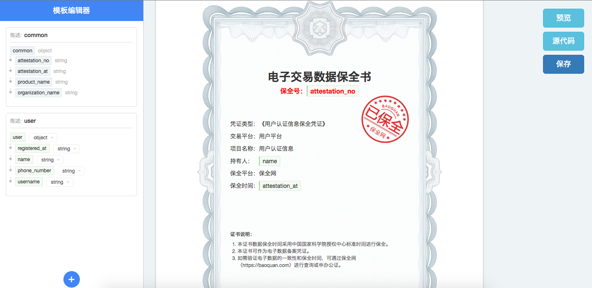

概述
===============

为了更好的使用保全网的API，您首先需要对涉及到的概念有一个基本的了解。

客户 - Member
---------------

客户是保全网的签约客户，也是保全网API的使用者。客户需要在保全网上注册，然后通过API将需要保全的数据传送给保全网，实现数据存证。

客户可以是企业，组织，或者个人。

用户 - User
---------------

用户是保全对应的所有者。用户可以通过保全号在保全网站查询保全内容，用户在保全网注册并通过身份认证后，还可以通过手机号、身份证号等身份标识查询到自己的保全数据。

用户可以是企业，组织，或者个人。

保全 - Attestation
-------------------

保全是一份用户数据存证。每一份保全拥有一个唯一的保全号，对应一位所有人。通过保全号用户可以查询到存证数据，申请公证。

每一份保全都有自己的关联模板，客户可以通过模板定义保全的样式。

保全的主要数据项包括：保全号，身份事项，模板ID，陈述集合。

身份标识 - Identity
-------------------

在创建保全时需要提供身份标识。身份标识是保全所有人的身份信息，您可以通过身份标识将保全所有人的身份信息，例如身份证号、电话号码、统一社会信用代码等与该保全关联起来，以便将来用户检索自己拥有的保全数据。一位用户也可以拥有多个身份标识。

Identity代码表:

=====  =============== 
代码    类型  
=====  =============== 
ID     身份证 
MO     手机号
USCID  统一社会信用代码
=====  =============== 

模板 - Template
---------------

模板是客户在保全网上使用模板编辑器编写的数据结构，模板可以方便客户定义一份有法律效力的电子数据。

陈述 - Factoid
---------------

陈述是保全网接收到的与某个保全关联的数据片段。一个保全可以只包含一个陈述，也可以包含多个陈述。通过API客户可以一次性将一份保全所有相关陈述发送给保全网，也可以通过多次API调用分开发送。

